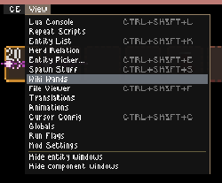
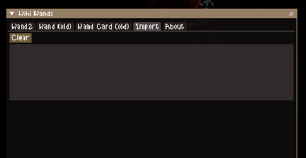
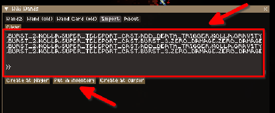
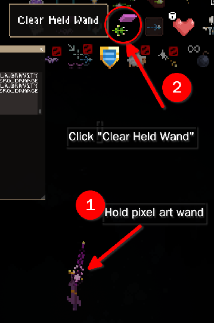

# Noita pixelart wand generator

A python script written to generate wands from a given image, and allows you to import it in noita for better rendering!


## Prerequisites
1. Downloaded [CE[Component Explorer]](https://noita.wiki.gg/wiki/Mod:Component_Explorer) in noita.
2. Downloaded [Glimmers Expanded](https://steamcommunity.com/sharedfiles/filedetails/?id=3316355233) by Sharpy796! You can also
check the mod out on their [github](https://github.com/Sharpy796/GlimmersExpanded/)
3. a terminal to work with. Windows would be CMD or Powershell. Linux would be any terminal.

### Setting up python
Install version of python that is >= 3.14 (you could try something lower but I haven't tested it on a lower version :P)

It's recommended you create a virtual environment to work with python! (type `python -m venv venv` to create a virtual environment called `venv` on your current directory)

**Virtual environment setup (Optional, but recommended)**

To use the virtual environment, you have to run the specified script file to activate the virtual environment

**Windows**:

(Sadly I don't have windows to test this out :(, but you have to run the `activate.bat` script in the `venv` directory)

```ps
./venv/Scripts/activate.bat
```

**Linux**:

Depending on your shell, you have to `source` the target `activate` file. For me, I use fish shell, so:
```bash
source ./venv/bin/activate.fish
```

If you are using regular bash, just source the regular ol' `activate` script:
```bash
source ./venv/bin/activate
```

**you need to install `pillow` and `numpy` for python**

type in your terminal
```
pip install pillow numpy
```

to install these two libraries in your system / virtual environment (if you did setup one)

## Optional Dependencies
1. [Spell lab shugged](https://steamcommunity.com/sharedfiles/filedetails/?id=3284126816) for very useful in
game tools (and can help prevent lag from wands!) by Shug, check out their [github](https://github.com/shoozzzh/Spell-Lab-Shugged)
as well!

2. [Glimmers Pixelart Expansion](https://github.com/AMAIOLAMO/glimmers_pixelart_expansion) just a simple mod that adds a lot of
color expansions to glimmer expanded mod


## How to use
**Basic Usage**

To use the script's bare minimum functionality, you run the following:
```bash
python noita_pxa.py --input <your input image> --output <your output file> --palette <your desired palette configuration>
```

I have supplied certain example images in the `example_images` directory, we can use that, for an example.

If you run:
```bash
python noita_pxa.py --input "example_images/mina.png" --output result.txt --palette firebomb_tinted_plt_exp.json
```

If you have my extended mod palette(Glimmers Pixelart Expansion),
you can switch the `firebomb_tinted_plt_exp.json` to `firebomb_tinted_plt_exp_cx.json` for a wider range of colors!

This command simply first reads the input image (in this case, `example_images/mina.png`), then utilizing the palette given
from `firebomb_tinted_plt_exp.json`(color palette sampled from `Glimmer Expanded` Mod and `FIREBOMB` projectile), then output
the resulting importable Component Explorer Wiki wand format in `result.txt` file under the current running directory.


**Importing**

To import the wand format, open `result.txt` and copy everything within there into your clipboard, run Noita (of course), go to
Component Explorer's options


- Open "Wiki Wands"


- Then open the "Import" Tab.


Now you should be able to paste the result in the inputbox, and click any of the 3 bottom buttons to spawn the wand.
I personally prefer to spawn the wand in inventory with the "**put in inventory**" option.



Voila~ You have the wand in game... But IT'S SUPER LAGGY... You can cast it tho now!


**Reducing lag**
The biggest lag factor actually is not the wand art, but the wand you have on your hand!
Noita renders a TON of pixels on your wand because of the amount of pixel glimmers and spells you have.

But fear not! There is a trick where in you can actually cast the wand even if you have 0 spells!
Noita remembers the spell casts if you did not "refresh it" (open inventory, add / change casts), hence
you can actually clear the entire wand without noita noticing to separate the wand loading, and rendering of the pixel art!

The reason why Spell lab shugged is extremely important is because it can help reduce lag
. If you have it installed, try selecting the pixelart wand by clicking at the top left
of the inventory hot bar in your screen.

Then what you can do, is to click at the top right to `show spell lab` and while holding the pixel art wand, click the
`clear held wand` option. This should reduce lag. By this point **DO NOT SWITCH ITEMS / OPEN INVENTORY** because you will lose
your current wand build! (actually you can use the "undo / redo" function in spell lab shugged if you accidentally refreshed it)



You can now shoot without that much lag from the wand! Wohoo :)

## Have fun!

