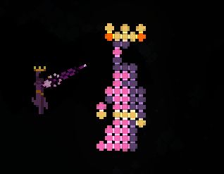
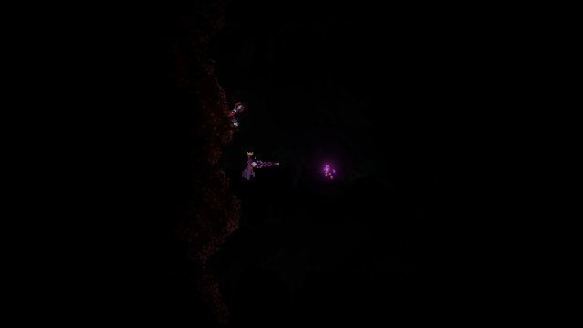
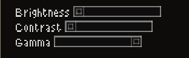

# Noita pixelart wand generator

A python script written to generate wands from a given image, and allows you to import it in noita for better rendering!


## Prerequisites
~~1. Download [CE[Component Explorer]](https://noita.wiki.gg/wiki/Mod:Component_Explorer) in noita.~~ ( Outdated :D )

1. Download [Noita Dear Imgui](https://github.com/dextercd/Noita-Dear-ImGui) here! this is required for loading pixelart as a mod.

2. Download [Glimmers Expanded](https://steamcommunity.com/sharedfiles/filedetails/?id=3316355233) by Sharpy796! You can also
check the mod out on their [github](https://github.com/Sharpy796/GlimmersExpanded/)

3. [CxRedix's Pixelart Expansion](https://github.com/AMAIOLAMO/cxredix_pixelart_expansion) just a simple mod that adds a lot of
color expansions glimmers and a loader for pixelart (this can automatically clear certain lag caused by loading the wand.)

4. a terminal to work with. Windows would be CMD or Powershell. Linux would be any terminal that runs any shell.

### Setting up python
Install version of python that is >= 3.14 (you could try something lower but I haven't tested it on a lower version :P)

### Virtual environment setup (Optional, but recommended)
It's recommended you create a virtual environment to work with python! To do that you can type:
```bash
python -m venv venv
```

to create a virtual environment called `venv` on your current directory.

To use the virtual environment, you have to run the specified script file to activate the virtual environment

**Windows**:

(Sadly I don't have windows to test this out :(, but you have to run the `activate.bat` script in the `venv` directory)

```ps
./venv/Scripts/activate.bat
```

**Linux**:

Depending on your shell, you have to `source` the target `activate` file. For me, I use fish shell, so:
```bash
source ./venv/bin/activate.fish
```

If you are using regular bash, just source the regular ol' `activate` script:
```bash
source ./venv/bin/activate
```

~~**you need to install `pillow` and `numpy` for python**~~

~~type in your terminal~~
~~pip install pillow numpy~~

You can now easily install all requirement by typing the following:
```
pip install -r requirements.txt
```

if you are curious what packages are downloaded, you can directly open `requirements.txt` in any text editor!

to install these two libraries in your system / virtual environment (if you did setup one)

## Optional Dependencies
1. [Spell lab shugged](https://steamcommunity.com/sharedfiles/filedetails/?id=3284126816) for very useful in
game tools (and can help prevent lag from wands!) by Shug, check out their [github](https://github.com/shoozzzh/Spell-Lab-Shugged)
as well!

2. [Unlimited Power](https://steamcommunity.com/sharedfiles/filedetails/?id=2102506229) to optimize the spells and remove
the need for reducing mana :) UNLIMITED POWAHHH (aka mana)


## How to use
**Basic Usage**

To use the script's bare minimum functionality, you run the following:
```bash
python noita_pxa.py --input <your input image> --output <your output file> --palette <your desired palette configuration>
```

I have supplied certain example images in the `example_images` directory, we can use that, for an example.

If you run:
```bash
python noita_pxa.py --input "example_images/mina.png" --output result.txt --palette firebomb_tinted_plt_exp.json
```

If you have my extended mod palette(Glimmers Pixelart Expansion),
you can switch the `firebomb_tinted_plt_exp.json` to `firebomb_tinted_plt_exp_cx.json` for a wider range of colors!

This command simply first reads the input image (in this case, `example_images/mina.png`), then utilizing the palette given
from `firebomb_tinted_plt_exp.json`(color palette sampled from `Glimmer Expanded` Mod and `FIREBOMB` projectile), then output
the resulting importable Component Explorer Wiki wand format in `result.txt` file under the current running directory.

**Preview**

You can preview the image by specifying a file path to generate the preview image file to, this utilizes the palette
and creates an example of how it would generally look like in game in terms of colors.

Here's an example:

```bash
python noita_pxa.py --input "example_images/mina.png" --output result.txt --palette firebomb_tinted_plt_exp.json --preview preview.png
```

as you can see, I just appended `--preview preview.png` at the end, and now the script should generate a preview image
for you by default in the image file `preview.png`. You can open it up in an image editor to view how it looks like!


This is how mina's preview looks like with the `firebomb_tinted_plt_exp.json` (firebomb + Glimmers Expanded Mod palette)


(I scaled it up for better viewing experience!)

**Importing**

**First make sure the CxRedix pixelart Expansion mod is below Noita Dear Imgui mod! This is important, as the wand loader only shows up
IF the mod can load Noita Dear Imgui!**

Next, go to your mod settings and go to my pixelart expansion mod, and turn on "Enable Wand Loader". When you go back to the game
and done everything successfully, you should be able to see a wand loader window with an input field!

To import the wand format, open `result.txt` and copy everything within there into your clipboard, go back to Noita then paste
everything into the field within "Wand Loader" window!

Now you should be able to see a few buttons show up after you pasted it, let's focus on "Load on held wand and clear".

As the label suggests, you have to hold a wand, any wand is fine, even the starter wand should work. Now you should be able to click
on the button "Load on held wand and clear" then you wait :), it's going to lag... and after you can cast!

WARNING: MAKE SURE YOUR INVENTORY IS NOT OPENED WHEN THIS PROCESS IS HAPPENING,
or else YOU WILL CRASH BECAUSE noita's UI cannot handle
that many slots :P

This is how it looks like in game:




Here is the gif render(in reality it's a lil bit laggy...)




**Tips for better viewing experience**

1. currently I have modded `FIREBOMB` projectile to be tinted white, this makes the colors
more accurate. You can change it in the settings for CxRedix Pixelart Expansion Mod (whether u like the OG colors or not)

2. You can change the in game settings, turn ***brightness*** and ***contrast*** all the way down.
Then turn ***gamma*** all the way up before you fire your pixelart :). This should make colors much better looking.



3. If you are using spell lab shugged, you can shift + left click the heart icon to lock mina's HP! This can be helpful
if you are not using the `--manainf` option, since mana is usually reduced by using `BLOOD_MAGIC`

**Reducing lag**


**NOTE: EVERYTHING BELOW HERE IS AUTOMATICALLY DONE BY THE WAND LOADER NOW :) (I still put it here for more explanation in case
you are curious)**

The biggest lag factor is actually not the wand art rendering itself, but the wand you have on your hand!
Noita renders a TON of particles and effects on your wand because of the amount of pixel glimmers and spells you have.

But fear not! There is a trick where in you can actually cast the wand even if you have 0 spells!
Noita remembers the spell casts if you did not "refresh it" (open inventory, add / change casts), hence
you can actually clear the entire wand without noita noticing to separate the wand loading, and rendering of the pixel art!

The reason why Spell lab shugged is extremely important is because it can help reduce lag
. If you have it installed, try selecting the pixelart wand by clicking at the top left
of the inventory hot bar in your screen.

Then what you can do, is to click at the top right to `show spell lab` and while holding the pixel art wand, click the
`clear held wand` option. This should reduce lag. By this point **DO NOT SWITCH ITEMS / OPEN INVENTORY** because you will lose
your current wand build! (actually you can use the "undo / redo" function in spell lab shugged if you accidentally refreshed it)


You can now shoot without that much lag from the wand! Wohoo :)


Another optimization you could do is to utilize the Unlimited Power mod shown above,
and specify the `--manainf` option while running the script. Simply before running the script,
put `--manainf` at the end of everything and the script will then assume you have enough mana to cast everything :).

This should remove all mana reducing spells (e.g. `BLOOD_MAGIC`) used within the wand spells!

## Have fun!

